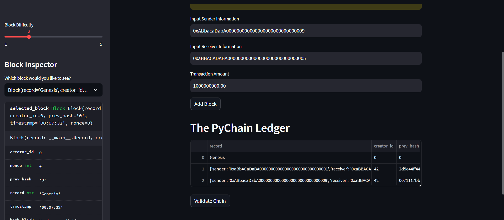
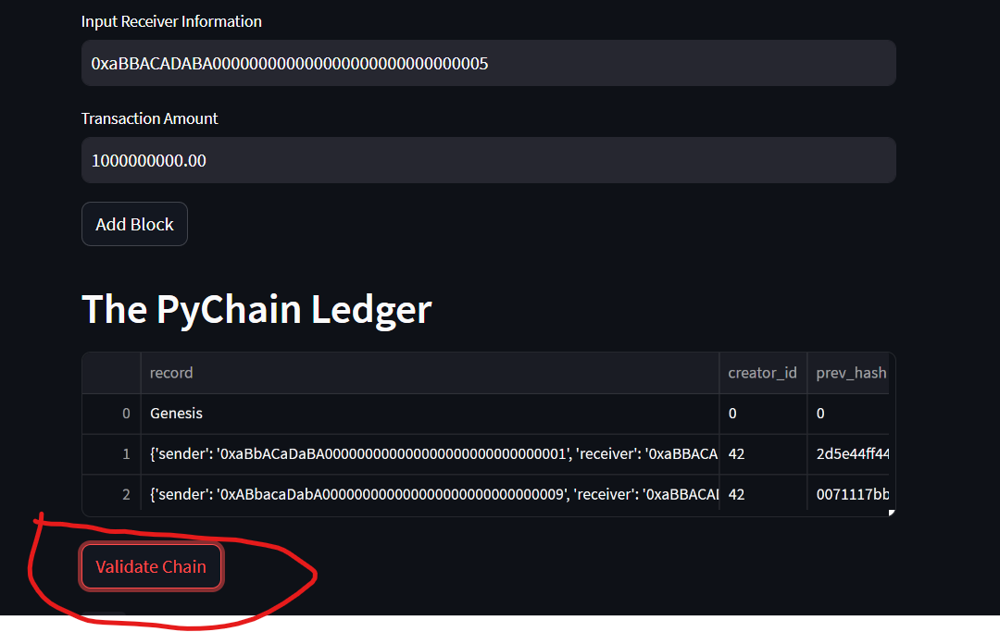

### Pychain Ledger
---
## Client: NPCU (National Pie Credit Union)

---
The National Pie Credit Union is the fastest growing Credit Union in state of North Carolina. NPCU's Founder & CEO Margret Appalachia Pie (also known as Ms. Apple) has contacted me to establish a blockchain framework that NPCU will use to track transactions on the Pychain Ledger.

---
I created the blockchain by executing the following steps
* Step 1: Create a Record Data Class
** I created a new data class named Record. This class will serve as the blueprint for the financial transaction records that the blocks of the ledger will store.
* Step 2: Modify the Existing Block Data Class to Store Record Data
** I changed the existing Block data class by replacing the generic data attribute with a record attribute that’s of type Record.
* Step 3: Add Relevant User Inputs to the Streamlit Interface
** I created additional user input areas in the Streamlit application. These input areas should collect the relevant information for each financial record so that I can store in the PyChain ledger.
* Step 4: Test the PyChain Ledger by Storing Records

---
## Results

With the power of Python and several imported libraries such as streamlit, pandas & hashlib I was able to successfully established the Pychain Blockchain. Below are several screenshots once I tested the final product:
*The initial transaction that I wanted to add to the blockchain to serve as the Genesis Block.

---
*How the Blockchain looks after 2 transactions.
---

---
#The chain has been validated.

